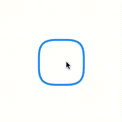
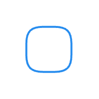

## 概述

在观看视频的时候发现了一个作者用 React-Native 做了一个 CheckBox 的动画很有意思，萌生出自己用 Flutter 实现一个的想法，于是就有了本篇文章和作品。

## 效果图



## 快速上手

1. 在 pubspec.yaml 添加

```
flutter_checkbox_animation: ^1.0.0
```

2. 使用

```
@override
  Widget build(BuildContext context) {
    return Center(
      child: CheckBoxAnimation(
        check: true,
        onValueChange: (value) {
          print(value);
        },
        highlightColor: Colors.blue,
        checkMarkColor: Colors.white,
        size: 100,
      ),
    );
  }
```

## 实现

涉及到的主要技术点有图形绘制和动画相关的知识点。

### 1. 绘制

首先定义一个类，继承 CustomPainter 来绘制。

```
class CheckPainter extends CustomPainter {
  @override
  void paint(Canvas canvas, Size size) {
    
  }
  
  @override
  bool shouldRepaint(covariant CustomPainter oldDelegate) => true;
}
```

绘制我们主要是放在 `void paint(Canvas canvas, Size size)` 这个方法中进行

首先定义两段路径，一段是 check 的外框 `outlineBoxPath`，一段是选中的勾 `checkMarkPath` :

```
// parseSvgPathData 方法是引用的 path_drawing 库，
// 该方法就是把 svg 的路径转成 canves 绘制的 Path 路径。
// 在 pubspec.yaml 加入 path_drawing: ^1.0.1

var checkMarkPath = parseSvgPathData(
'M15 31.1977C23.1081 36.4884 29.5946 43 29.5946 43C29.5946 43 37.5 25.5 69 1.5');

var outlineBoxPath = parseSvgPathData(
'M24 0.5H40C48.5809 0.5 54.4147 2.18067 58.117 5.88299C61.8193 9.58532 63.5 15.4191 63.5 24V40C63.5 48.5809 61.8193 54.4147 58.117 58.117C54.4147 61.8193 48.5809 63.5 40 63.5H24C15.4191 63.5 9.58532 61.8193 5.88299 58.117C2.18067 54.4147 0.5 48.5809 0.5 40V24C0.5 15.4191 2.18067 9.58532 5.88299 5.88299C9.58532 2.18067 15.4191 0.5 24 0.5Z');
```


首先 CheckBox 有两种状态：一种是未选中，另一种是选中状态

绘制未选中的样式：首先定义一个画笔，然后把 `outlineBoxPath` 绘制

```
// 定义画笔
final Paint paint = Paint();
paint.strokeWidth = 6;
paint.strokeCap = StrokeCap.round;
paint.strokeJoin = StrokeJoin.round;
paint.strokeCap = StrokeCap.round;
paint.color = _highlightColor;
paint.style = PaintingStyle.stroke;

// 绘制未选中的外框
canvas.drawPath(outlineBoxPath, paint);

```



接着绘制选中的状态，选中的状态有三部分：
1. 填充方式绘制的 `outlineBoxPath`
2. 和 `outlineBoxPath` 颜色一致的 `checkMarkPath`
3. 在 `outlineBoxPath` 范围内里面绘制 _checkMarkColor 的 `checkMarkPath`

```
// 填充方式 - 绘制
paint.style = PaintingStyle.fill
canvas.drawPath(outlineBoxPath, paint);

paint.strokeWidth = 6;
paint.style = PaintingStyle.stroke;
paint.color = _highlightColor;
canvas.drawPath(checkMarkPath, paint);

// 改变颜色
paint.color = _checkMarkColor
// 设置裁切范围
canvas.clipPath(outlineBoxPath);
canvas.drawPath(checkMarkPath, paint);

```


### 动画部分

创建动画

```
_controller = AnimationController(
duration: const Duration(milliseconds: 300),
  value: 1,
  vsync: this,
);

_animation = CurvedAnimation(
  parent: _controller,
  curve: Curves.easeIn,
);
```

通过动画来调整 `checkMarkPath` 的绘制进度

先计算出需要绘制的 `checkMarkPath` 的路径长度，更具 animatin.value 的值计算出进度，用 extractPath 生成字路径绘制

```
PathMetrics pathMetrics = checkMarkPath.computeMetrics();
late Path extractPath;
for (PathMetric pathMetric in pathMetrics) {
  extractPath = pathMetric.extractPath(
	0.0,
    pathMetric.length * value,
  );
}

// ....替换绘制的两处
// canvas.drawPath(checkMarkPath, paint); ->
canvas.drawPath(extractPath, paint);
// ....
```

接着执行动画就可以看到首页的效果图。

### 设配大小

现在出来的样式没办法调整大小，调整大小就是对path的路径按照 canves 的大小进行比例放大之后绘制，代码如下：

```
void setSizePath(Size size) {
    final finalPath = Path()
      ..addPath(outlineBoxPath, Offset.zero)
      ..addPath(checkMarkPath, Offset.zero);
      // 获取路径的大小
    final Rect pathBounds = finalPath.getBounds();
    final Matrix4 matrix4 = Matrix4.identity();
    double scaleSize = pathBounds.height;
    if (pathBounds.width > pathBounds.height) {
      scaleSize = pathBounds.width;
    }
    // 设置缩放
    matrix4.scale(size.width / scaleSize);
    // 缩放之后的路径
    outlineBoxPath = outlineBoxPath.transform(matrix4.storage);
    checkMarkPath = checkMarkPath.transform(matrix4.storage);
}
```


## 参考

1. https://github.com/craftzdog/react-native-checkbox-reanimated
2. https://github.com/dnfield/flutter_path_drawing